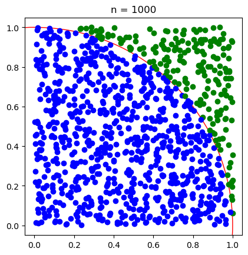

# Estimate π to 3 decimal places using a Monte Carlo method. 


## Approach 

A monte Carlo method uses random sampling to obtain numerical results. In the case of determining pi, we can first imagine a circle quadrant contained within a unit square: 
<p align="center">
  
</p>
It can be shown that a circle quadrant of radius $r$, within a square of side length $z$, that:
$$A_{quadrant} = \frac{\pi r^2}{4} = \frac{\pi z^2}{4} = \frac{\pi}{4}A_{sqaure}  $$ 
and therefore:
$$\pi =4  \frac{A_{quadrant}}{A_{sqaure}} $$
  
Knowing this, we can use the following Monte Carle method to estimate pi:
1. Scatter a random sample of points across the domain of the square
2. Count the number of points that fall within the circle
3. Calculate the ratio of the points inside and the total number of points, which when multiplied by 4 gives the estimate for pi

## The Coding


```python
import numpy as np 
import matplotlib.pyplot as plt
```

### Function to estimate pi using Monte Carlo method


```python
def estimate_pi(size=1000000):
    inside = 0
    outside = 0
    x = np.random.uniform(size=size)
    y = np.random.uniform(size=size)
    for n in range (0,size):
        if x[n]**2 + y[n]**2 <= 1:
            inside += 1
    estimate = round(4*(inside/size),3)
    return estimate
```


```python
print(estimate_pi())
```

    3.142
    

### Example with diagram for n = 1000 sample size


```python
fig, ax = plt.subplots(1,1)
plt.title('n = 1000')
ax.set_box_aspect(1)
circle = plt.Circle((0, 0), 1, color='r',fill = False)
ax.add_artist(circle)
size = 1000
inside = 0
outside = 0
x = np.random.uniform(size=size)
y = np.random.uniform(size=size)
for n in range (0,size):
    if (x[n]**2 + y[n]**2) > 1:
        plt.scatter(x[n], y[n], color = 'green')
    else:
        inside += 1
        plt.scatter(x[n], y[n], color = 'blue')
estimate = 4*(inside/size)
plt.show()
print("The sample shown in the figure finds an estimate value of",estimate,"for pi.")


```


    

    


    The sample shown in the figure finds an estimate value of 3.208 for pi.
    
